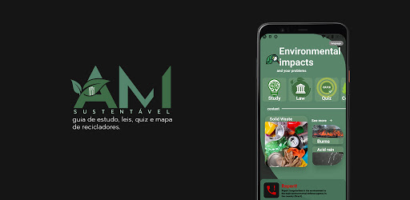

<h1 align="center">
    
</h1>
<p align="center">Neste repositório, você vai encontrar uma aplicação mobile, desenvolvida para a<br/>Adriana Douran, ativista ambientál 🎓 (2020/2021). <br/> A aplicação inclui o Backend provido por um BaaS e Mobile com React Native e TypeScript.</p>


# :coffee: Build Setup

Para rodar o projeto, você precisa: [Node.js](https://nodejs.org/) para rodar localmente.

### Pré-requisitos

Antes de começar, você vai precisar ter instalado em sua máquina as seguintes ferramentas:
[Git](https://git-scm.com), [Node.js](https://nodejs.org/en/).
Além disto é bom ter um editor para trabalhar com o código como [VSCode](https://code.visualstudio.com/)

# Informações adicionais

Este projeto foi desenvolvido em Typescript utilizando React Hooks, styled-components e agilidade prática de código limpo.

# :iphone: Mobile

Após clonar o repositório, entre na raiz do projeto e instale todas as dependências utilizando o comando:
```bash
# Digite o comando abaixo para instalar as dependências:
yarn install
```
Depois, digite o comando abaixo para iniciar a aplicação:
```bash
# Irá iniciar o metrobundler
yarn start
```
E para iniciar a aplicação no emulador:
```bash
# Para emulador Android:
yarn android

# Para emulador IOS:
yarn ios
```
<br>

### 🛠 Tecnologias

As seguintes ferramentas foram usadas na construção do projeto:

- [Node.js](https://nodejs.org/en/)
- [React](https://pt-br.reactjs.org/)
- [React Native](https://reactnative.dev/)
- [TypeScript](https://www.typescriptlang.org/)


# Colabore

Você pode colaborar com este projeto, dê um Fork no mesmo e envia a sua pull request com uma nova feature/correção de bugs e etc...
Será muito bem vindo!

# :memo: License

This project is under the MIT license. See the [LICENSE](LICENSE.md) file for more details.


### Autor
---


<div align="center">
<a href="https://www.linkedin.com/in/lucianolimafer/">
 
 <br />
 <sub><b>Luciano Lima Fer</b></sub></a> <a href="https://www.linkedin.com/in/lucianolimafer/" title="Luciano Lima Fer">🚀</a>

Feito com ❤️ por Luciano Lima Fer 👋🏽 Entre em contato!
</div>
